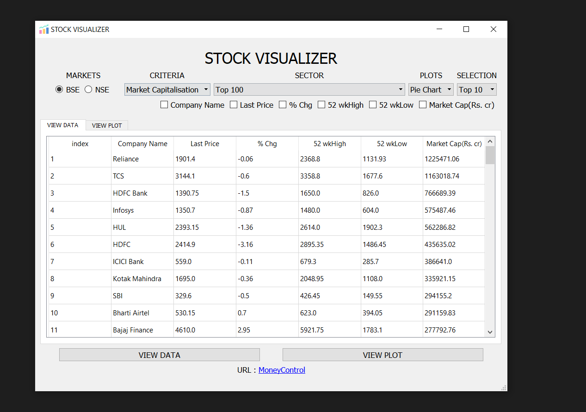
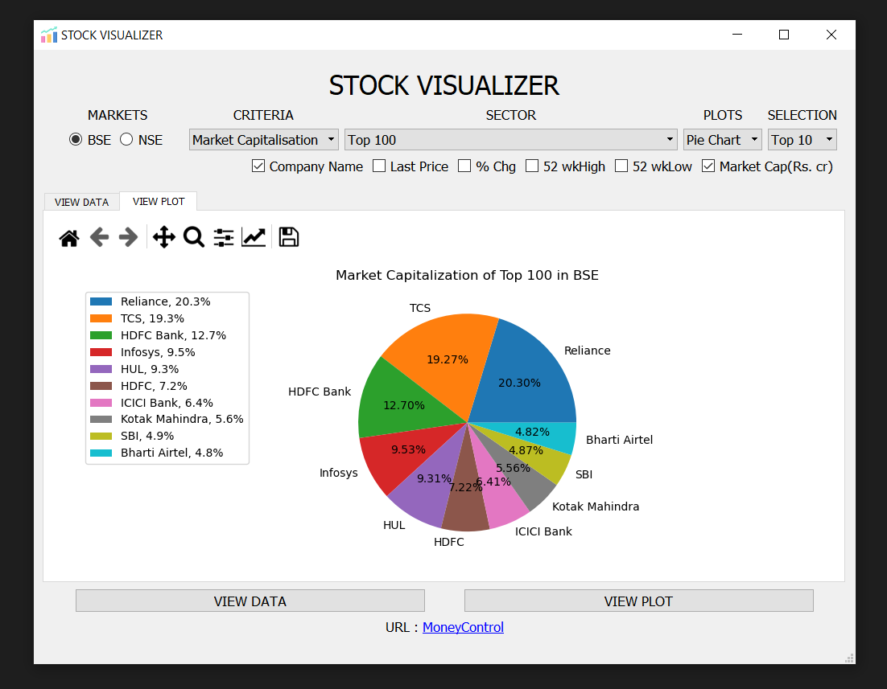
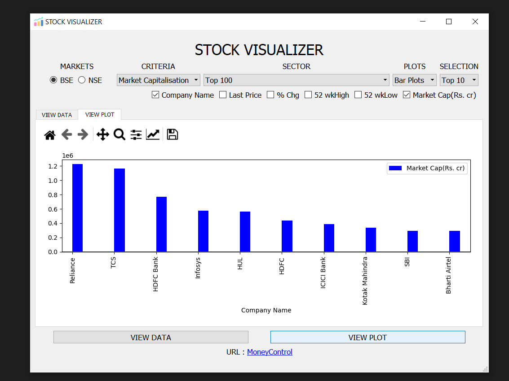
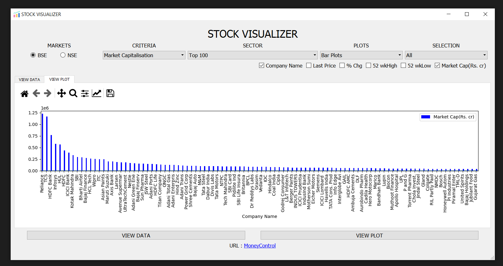
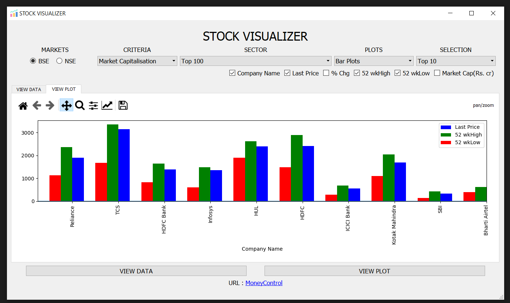

# STOCK VISUALIZER

This is a GUI App built in Python Using PyQt5 that Fetches the Data from MoneyControl.com and displays it in Tablular Format as well as provides intutive Plots to Visualize the Data.

Currently It Supports Pie Chart and Bar Plots which satisfy certain criteria.
Do Use this Application and let me know if you Like it.

### Screens

